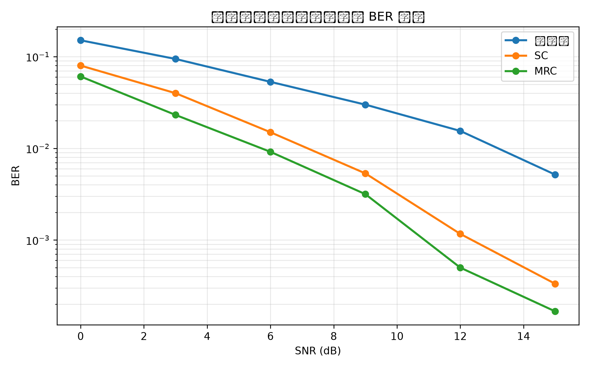
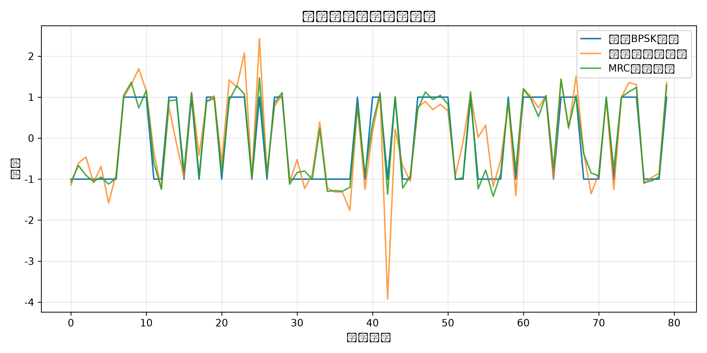
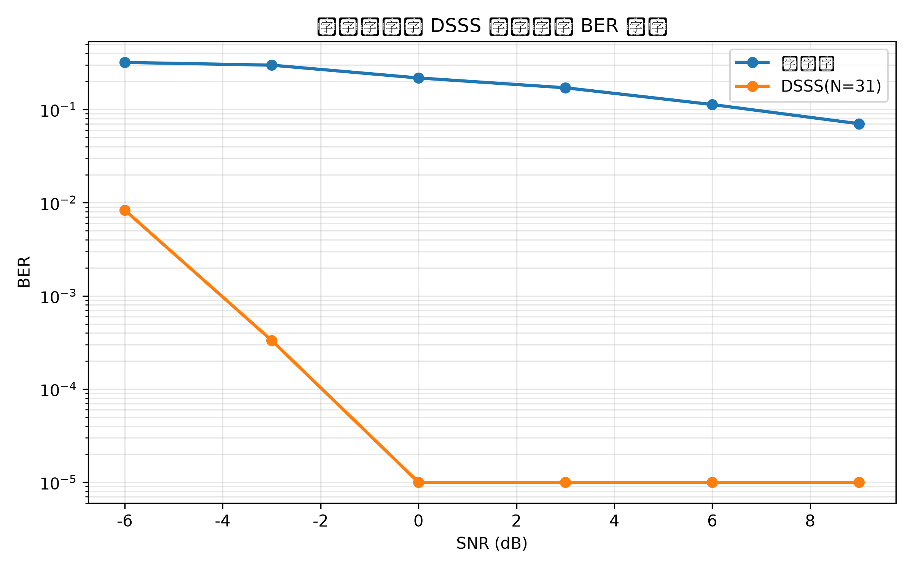
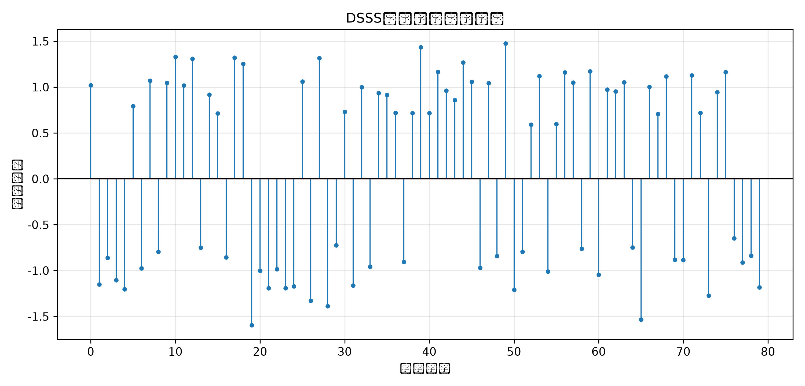

# 无线通信技术实验报告：分集与扩频通信

姓名：孙浩然 
学号：2022280450  
班级：22级文华  
日期：2026年6月4日

## 1. 实验目的

本实验围绕无线通信中的分集合并和直接序列扩频通信两个主题展开。通过本实验，我需要理解瑞利平坦衰落信道中深衰落对误比特率的影响，掌握接收分集的基本思想，能够用 Python 实现选择合并（Selection Combining, SC）和最大比合并（Maximal Ratio Combining, MRC），并通过 BER 曲线比较单分支、SC 和 MRC 的性能差异。另一方面，本实验还要求理解直接序列扩频（Direct Sequence Spread Spectrum, DSSS）的基本收发流程，掌握 m 序列生成、BPSK 符号扩频、相关解扩和处理增益计算方法，观察扩频通信在窄带干扰环境下的抗干扰能力。

除通信理论和算法实现外，本实验还要求熟悉 GitHub 自动评分流程，包括 Fork 教师仓库、在本地补全 TODO、运行 pytest 和评分脚本、生成结果图、根据模板撰写 REPORT.md，并通过 Pull Request 提交实验结果。

## 2. 实验原理

### 2.1 分集合并

无线信道受到多径传播、遮挡和移动等因素影响时会产生衰落。在瑞利平坦衰落模型中，每个符号经过复信道系数 \(h\) 后到达接收端，接收信号可写为

\[
r = hs + n
\]

其中 \(s\) 为发送的 BPSK 符号，\(n\) 为加性噪声。当 \(|h|\) 很小时，接收信号会出现深衰落，单分支接收容易产生误判。分集的思想是让同一信号经过多个相互独立或弱相关的支路传播，接收端再根据信道状态对多个副本进行选择或合并。由于多个独立支路同时发生深衰落的概率远小于单个支路发生深衰落的概率，因此分集可以显著降低误比特率。

选择合并 SC 的做法是对每一个符号选择瞬时信道功率最大的分支，即选择 \(|h_i|^2\) 最大的支路，然后对该支路做均衡：

\[
\hat{s}=\frac{r_k}{h_k}, \quad k=\arg\max_i |h_i|^2
\]

SC 实现简单，只使用最强分支，但没有充分利用其他分支上的有效信号能量。

最大比合并 MRC 则使用所有支路。对于第 \(i\) 个分支，先乘以信道共轭 \(h_i^*\) 进行相位校正，并按信道幅度加权，再用总信道功率归一化：

\[
\hat{s}=\frac{\sum_i h_i^* r_i}{\sum_i |h_i|^2}
\]

MRC 在各分支噪声功率相同且信道估计准确时可以获得最大输出信噪比，因此通常优于 SC。实验中的 `selection_combining`、`maximal_ratio_combining` 和 `simulate_diversity_ber` 就是围绕上述公式实现的。

### 2.2 扩频通信

直接序列扩频 DSSS 是将低速数据信号与高速伪随机 PN 序列相乘，使信号在频域上被展宽。设原始比特经 BPSK 映射后得到符号 \(a\in\{+1,-1\}\)，PN 码片序列为 \(c=[c_0,c_1,\ldots,c_{N-1}]\)，其中每个码片取值为 \(+1\) 或 \(-1\)。扩频后的码片序列为

\[
x = a c
\]

接收端使用相同且同步的 PN 序列进行相关解扩：

\[
y=\sum_{k=0}^{N-1} r_k c_k
\]

若相关输出非负，则判决为比特 0；若相关输出为负，则判决为比特 1。由于目标信号与本地 PN 序列同步，解扩后能量会重新集中；而窄带干扰与 PN 序列通常不相关，经过相关运算后会被分散和摊薄，因此 DSSS 具有抗窄带干扰能力。

m 序列是一类由线性反馈移位寄存器（LFSR）产生的伪随机序列。本实验约定寄存器从左到右编号，输出右端寄存器比特，抽头位置为从左到右的 1-based 位置，反馈比特由抽头比特异或得到，再插入寄存器左端。若寄存器长度为 \(m\)，在合适抽头下最大周期为 \(2^m-1\)。本实验将输出比特映射为双极性码片：0 映射为 \(+1\)，1 映射为 \(-1\)。

DSSS 的处理增益由扩频因子决定，公式为

\[
G_p = 10\log_{10}(N)\ \text{dB}
\]

其中 \(N\) 为每个信息符号对应的 PN 码片数。扩频因子越大，相关解扩带来的能量集中效果越明显，窄带干扰被摊薄的程度也越高，但频谱占用也随之增大。

## 3. 实验环境

- Python 版本：Python 3.13.13
- 操作系统：Linux
- 主要依赖：NumPy、Matplotlib、pytest、pylint
- 仓库：`wireless-dirvesity-spread-exp`
- 主要修改文件：`src/part1_diversity.py`、`src/part2_spread_spectrum.py`、`REPORT.md`
- AI 助手使用情况：本实验使用 AI 辅助理解 SC、MRC、DSSS、m 序列和相关解扩公式，辅助检查代码实现思路、测试命令和报告结构。最终代码经过本地 pytest 和实验脚本运行验证，核心函数的输入输出、公式含义和实现流程均已理解。

## 4. 实验方法与步骤

### 4.1 Part 1：分集合并

首先在 `src/part1_diversity.py` 中实现选择合并函数。程序先把 `received` 和 `channel` 转换为二维复数数组，并检查两者形状是否一致。然后对每个符号计算所有分支的 \(|h|^2\)，通过 `np.argmax(..., axis=0)` 找到最强分支的索引，再用对应的接收样本除以对应信道系数，得到一维均衡输出。

接着实现最大比合并函数。程序按列对所有分支求和，分子为 `np.sum(np.conj(channel) * received, axis=0)`，分母为 `np.sum(np.abs(channel) ** 2, axis=0)`，最终输出分子除以分母。这个实现既完成了相位校正，也完成了信道功率归一化。

最后实现 BER 仿真函数。程序在每个 SNR 点生成独立瑞利衰落多分支接收信号，分别计算单分支均衡、SC 合并和 MRC 合并的判决结果，再调用 `calculate_ber` 统计误比特率。返回值为包含 `单分支`、`SC`、`MRC` 三条曲线的字典。运行 `python src/part1_diversity.py` 后生成分集 BER 曲线和分集合并波形快照。

### 4.2 Part 2：DSSS 扩频通信

首先实现 m 序列生成函数。程序检查寄存器初始状态是否为非全零二进制序列，检查抽头位置是否合法；如果没有指定长度，则默认输出 \(2^m-1\) 个码片。每次时钟输出当前寄存器最右端比特，根据抽头比特异或得到反馈，将寄存器整体右移，并把反馈插入左端。最后将输出比特映射为双极性 PN 码片。

然后实现 DSSS 扩频函数。程序将输入比特按 BPSK 规则映射，0 对应 \(+1\)，1 对应 \(-1\)。每个 BPSK 符号乘以完整 PN 码片序列，因此输出长度为 `len(bits) * len(pn_chips)`。

接着实现 DSSS 解扩函数。程序先检查接收码片长度是否为 PN 长度的整数倍，再把接收序列 reshape 成二维矩阵，每一行对应一个信息符号的所有码片。对每一行与 PN 序列做内积相关，相关值非负判为 0，相关值为负判为 1。

最后实现处理增益函数，直接返回 `10 * np.log10(spreading_factor)`。运行 `python src/part2_spread_spectrum.py` 后生成 DSSS BER 曲线和相关输出快照。

## 5. 实验结果

### 5.1 分集合并 BER 曲线

该图比较了瑞利衰落信道下单分支、选择合并 SC 和最大比合并 MRC 的 BER 曲线。随着 SNR 增大，三条曲线都呈下降趋势。分集合并曲线整体低于单分支曲线，说明多分支接收降低了深衰落导致误码的概率。MRC 通常又低于 SC，这是因为 MRC 利用了所有分支的信号能量，而 SC 只选择最强的单个分支。

### 5.2 分集合并波形快照

该图展示了发送 BPSK 符号、单分支均衡输出和 MRC 合并输出的短时波形。单分支输出在衰落和噪声影响下波动较大，而 MRC 输出更接近原始符号序列，说明最大比合并能够通过多支路加权降低衰落和噪声对判决的影响。

### 5.3 DSSS BER 曲线

该图比较了窄带干扰环境下未扩频系统和 DSSS 系统的 BER。DSSS 使用长度为 31 的 PN 序列，因此处理增益约为 \(10\log_{10}(31)\approx14.91\) dB。实验结果中，DSSS 曲线通常低于未扩频曲线，说明相关解扩能将目标信号能量集中，同时把未同步的窄带干扰摊薄，从而提升抗干扰性能。

### 5.4 DSSS 相关输出快照

该图显示每个符号经过解扩后的相关输出。相关值的正负决定最终比特判决，正相关对应比特 0，负相关对应比特 1。在存在噪声和窄带干扰时，相关输出仍然大多保持明显的正负极性，说明 PN 相关解扩能够增强同步目标信号的判决可靠性。

## 6. 结果分析与讨论

瑞利衰落会造成深衰落，是因为接收信号由大量多径分量叠加形成。当多个分量相位接近相反时，接收端总幅度可能显著减小，此时即使平均 SNR 较高，瞬时 SNR 也可能很低，导致误码率突然升高。分集技术通过多个独立支路接收同一信息，使所有支路同时处于深衰落的概率显著降低，因此能改善 BER。

SC 和 MRC 的核心区别在于信息利用程度不同。SC 只选择当前信道功率最大的支路，因此实现简单、复杂度低，但会丢弃其他支路中的有效信号。MRC 对所有支路做共轭相位校正和幅度加权，再进行归一化合并，因此能够充分利用所有分支的信号能量。在噪声功率相同、信道估计准确的条件下，MRC 可以获得最大输出 SNR，所以仿真中 MRC 一般优于 SC。

DSSS 的处理增益由扩频因子 \(N\) 决定，本实验中 PN 序列长度为 31，因此处理增益约为 14.91 dB。处理增益越大，扩频后每个信息符号对应的码片越多，接收端相关累加后目标信号能量越集中。窄带干扰与 PN 序列不同步、不相关，经过乘 PN 码和积分相关后不会像目标信号一样同相累加，而是被扩展和平均，所以对判决的影响降低。

从 BER 曲线看，分集合并和 DSSS 的实验结果均符合理论预期：分集能够降低瑞利深衰落带来的误码，MRC 性能优于或不差于单分支；DSSS 在窄带干扰下具有更好的误码表现，相关输出也能保持较明显的判决极性。实际实验曲线可能因随机种子、比特数、SNR 点和干扰参数不同而有轻微波动，但总体趋势应保持一致。

## 7. 实验心得

通过本实验，我进一步理解了无线通信系统中“对抗不可靠信道”的两种重要思路。分集技术不是直接消除衰落，而是通过多个相互独立的信道副本降低深衰落同时发生的概率。SC 体现了“选最好支路”的思想，MRC 体现了“所有支路按可靠性加权合并”的思想。实现 MRC 时必须使用信道共轭，因为复信道不仅改变幅度，也改变相位，只有先校正相位后才能进行有效相干合并。

DSSS 实验让我理解了扩频通信的本质：发送端用高速 PN 序列扩展频谱，接收端用相同且同步的 PN 序列进行相关解扩。同步目标信号会被相关累加增强，而非同步干扰会被摊薄。m 序列生成过程也体现了移位寄存器和异或反馈的伪随机特性。处理增益公式虽然简单，但它直接说明了扩频因子和抗干扰能力之间的关系。

在工程流程方面，本实验再次熟悉了 GitHub 作业提交方法。本地先运行 pytest 和评分脚本可以提前发现函数接口、输入检查、输出长度和结果图缺失等问题。报告必须严格按照模板完成，包含实验目的、原理、方法、结果图、分析、心得、AI 使用说明和参考资料，否则自动报告检查会扣分。

## 8. 参考资料

- 课程课件：第8章 分集。
- 课程课件：第9章 扩展频谱通信。
- 实验仓库 README.md：分集与扩频通信实验说明。
- 实验仓库 REPORT_TEMPLATE.md：实验报告模板。
- `src/utils.py`、`grading/test_part1_diversity.py`、`grading/test_part2_spread_spectrum.py` 中给出的工具函数和测试要求。
